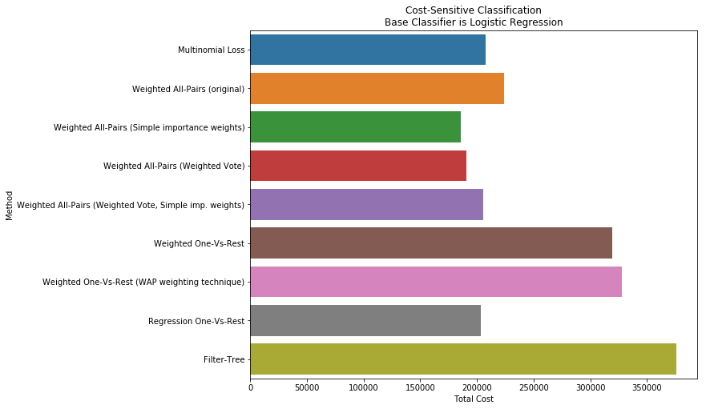

# Cost-Sensitive Multi-Class Classification

This Python/R package contains implementations of reduction-based algorithms for cost-sensitive multi-class classification from different papers, plus some simpler heuristics for comparison purposes.

## Problem description

Cost-sensitive multi-class classification is a problem related to multi-class classification, in which instead of there being one or more "correct" labels for each observation, there is an associated vector of costs for labeling each observation under each label, and the goal is to build a classifier that predicts the class with the minimum expected cost.

It is a more general problem than classification with costs defined for its confusion matrix (i.e. specifying how costly it is for each label to predict each other different label) or multi-class classification with observation weights (i.e. misclassifying each observation has a different cost, but this cost is the same regardless of the true and the predicted class), as here each observation can have a different cost for each type of misprediction.

When the costs are in the form of `C = {1*I(yhat = y)}` (that is, the cost for predicting the right labels is zero, while the cost for predicting a wrong label is one), the problem is equivalent to maximizing multiclass classification accuracy.

The aim of the algorithms here is to reduce this problem to binary classification with sample weights, which is a more well-studied problem for which many good algorithms are available. A further reduction to binary classification without sample weights is possible through the costing-proportionate rejection-sampling method, also implemented here.


## Algorithms

The following algorithms are implemented:
* `WeightedAllPairs` (see "Error limiting reductions between classification tasks" and "Machine learning techniques—reductions between prediction quality metrics")
* `RegressionOneVsRest` (see "Machine learning techniques—reductions between prediction quality metrics")
* `WeightedOneVsRest` (a heuristic with no theoretical guarantees based on the minimum cost of the 'rest' choice)
* `FilterTree` (see "Multiclass classification with filter trees")(Python only)

For binary classifiers which don't support importance weighting, also an implementation of Cost-Proportionate Rejection Sampling is provided (`CostProportionateClassifier`, see "Machine learning techniques—reductions between prediction quality metrics").

These are implemented as classes under the same names above, with corresponding `fit` and `predict` methods, plus a `decision_function` method (only when base classifier has `predict_proba` method). They require as input a base classifier with `fit` and `predict` methods that would allow a `sample_weight` argument to its `fit` method (e.g. pretty much all classifiers from scikit-learn and scikit-learn-compatible such as xgboost).

They also contain options to try slight variations, such as using weights as simply the difference between the cost of one class vs. another for `WeightedAllPairs`, which don't enjoy the same theoretical regret bounds but in practice can do better than more elaborate choices. You can check these options in the documentation of each algorithm.

The variants implemented here are based on multiple oracle calls (building a series of classifiers) rather than on single oracle call with index as features (building only one classifier, with the labels compared as extra columns in the data), as these tend to result in easer subproblems and to give more consistent results across problems.


## Installation


* Python:

```pip install costsensitive``` 

* R:

```devtools::install_github("david-cortes/costsensitive")```

## Sample usage

(For the R version, see the documentation inside the package for examples)

```python 
import numpy as np
from sklearn.linear_model import LogisticRegression, Ridge
from costsensitive import WeightedAllPairs, WeightedOneVsRest,
		RegressionOneVsRest, FilterTree, CostProportionateClassifier

### Generating totally random observations and costs
### This is a dataset with 1000 observations, 20 features, and 5 classes
X = np.random.normal(size = (1000, 20))
C = np.random.gamma(1, 5, size=(1000, 5))

### In case your classifier doesn't support sample weights
classifier_with_weights = CostProportionateClassifier(LogisticRegression())

### WeightedAllPairs
costsensitive_classifier = WeightedAllPairs(LogisticRegression(), weigh_by_cost_diff = True)
costsensitive_classifier.fit(X, C)
costsensitive_classifier.predict(X, method='most-wins')
costsensitive_classifier.decision_function(X, method='goodness')

### WeightedOneVsRest
costsensitive_classifier = WeightedOneVsRest(LogisticRegression(), weight_simple_diff = False)
costsensitive_classifier.fit(X, C)
costsensitive_classifier.predict(X)
costsensitive_classifier.decision_function(X)

### RegressionOneVsRest
### Takes a regressor rather than a classifier
costsensitive_classifier = RegressionOneVsRest(Ridge())
costsensitive_classifier.fit(X, C)
costsensitive_classifier.predict(X)
costsensitive_classifier.decision_function(X)

### FilterTree
### Implemented for comparison purposes, not recommended to use in practice
costsensitive_classifier = FilterTree(LogisticRegression())
costsensitive_classifier.fit(X, C)
costsensitive_classifier.predict(X)
``` 

For a more detailed example, see the IPython notebook [Cost-Sensitive Multi-Class Classification](http://nbviewer.jupyter.org/github/david-cortes/costsensitive/blob/master/example/costsensitive_multiclass_classification.ipynb).

**Results on CovType data set, artificially set costs (see link above)**


## Documentation

Documentation for Python is available at [http://costsensitive.readthedocs.io/en/latest/](http://costsensitive.readthedocs.io/en/latest/). For R, it's available as part of the package.

All code is internally documented through docstrings (e.g. you can try `help(WeightedAllPairs)`, `help(WeightedAllPairs.fit)`, `help(WeightedAllPairs.predict)`, etc. - in R: `help(costsensitive::weighted.all.pairs)` and so on).

## Some comments

In general, you would most likely be best served by using `WeightedAllPairs` with default arguments. The pairwise weighting technique from "Error limiting reductions between classification tasks" doesn't seem to improve expected cost in practice compared to simply defining weight as the difference in cost between two classes.

All-Pairs however requires fitting `m*(m-1)/2` classifiers, where `m` is the number of classes. If there are too many classes, this means fitting a very large number of classifiers, in which case you might want to consider `RegressionOneVsRest` - it works with a regressor rather than a classifier, as the name suggests.

The `FilterTree` method from "Multiclass classification with filter trees" tends to work really bad in practice with linear classifiers such as logistic regression, as it implies mixing together classes, which can result in very hard classification problems. Only recommended for tree-based classifiers.

## References 

* Beygelzimer, A., Dani, V., Hayes, T., Langford, J., & Zadrozny, B. (2005, August). Error limiting reductions between classification tasks. In Proceedings of the 22nd international conference on Machine learning (pp. 49-56). ACM. 
* Beygelzimer, A., Langford, J., & Zadrozny, B. (2008). Machine learning techniques—reductions between prediction quality metrics. In Performance Modeling and Engineering (pp. 3-28). Springer US. 
* Beygelzimer, A., Langford, J., & Ravikumar, P. (2007). Multiclass classification with filter trees. Preprint, June, 2. 
